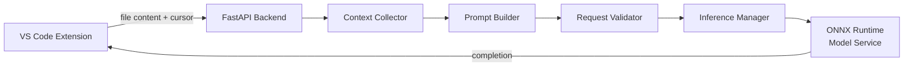

<div align="center">

# Dockerfile Autocomplete

**Inline AI completions for Dockerfiles, powered by an 80M-parameter transformer trained from scratch — running entirely on your own machine.**

  -green.svg) 

**This project is under active development — the model is being retrained and improved over time, with newer checkpoints published to this repo as they're ready.**

</div>

---

## Contents

- [What is this](#what-is-this)
- [Features](#features)
- [How it works](#how-it-works)
- [The model](#the-model)
- [Quickstart](#quickstart)
- [Performance](#performance)
- [Advanced configuration](#advanced-configuration)
- [Project structure](#project-structure)
- [Why local, not cloud](#why-local-not-cloud)
- [License](#license)

---

## What is this

A GitHub Copilot–style inline autocomplete experience, purpose-built for Dockerfiles instead of general code — backed by a small transformer trained from scratch specifically on Dockerfile/IaC syntax, not a general-purpose LLM API.

- **Inline ghost-text suggestions** as you type, accept with `Tab`
- **Runs 100% locally** — no cloud account, no API key, no billing
- **Small and fast to run on CPU** — no GPU required
- **Self-contained** — Docker image or a single standalone binary, your choice

## Features

- **Inline ghost-text completions** inside real Dockerfiles, using VS Code's native inline completion API (same UX pattern as Copilot) — no custom UI, no extra panel
- **Debounced, cancellable requests** — typing quickly doesn't pile up stale completions; a newer keystroke aborts the in-flight request for the old one
- **Trained from scratch**, not fine-tuned from an existing base model — architecture, tokenizer, and training data were all chosen specifically for Dockerfile/IaC syntax rather than inherited from a general-purpose model
- **CPU-only inference** via ONNX Runtime — no GPU, no CUDA drivers, no quantization tricks needed at this model size
- **Two ways to run it locally** — a Docker image for a reproducible environment, or a single standalone executable for a "download and run" experience with no dependencies at all
- **Decoupled model releases** — the ONNX weights are versioned on Hugging Face Hub separately from the Docker image, so a new fine-tuned checkpoint doesn't require touching the extension or rebuilding from scratch

## How it works



The extension only captures editor state and renders ghost text — every decision (context bounding, prompt construction, validation, generation limits) happens server-side, so the extension itself stays thin.

| Stage | Responsibility |
|---|---|
| Context Collector | Bounds the text sent for processing to a fixed character window before the cursor — never ships the whole file |
| Prompt Builder | Normalizes whitespace and token-truncates the context to the model's window; has no knowledge of inference |
| Request Validator | Rejects empty/out-of-bounds requests before they ever reach the model, with structured JSON errors |
| Inference Manager | Serializes access to the single persistent model instance through one worker thread, and enforces a request timeout |
| Model Service | Owns the ONNX Runtime session, runs greedy decoding, and stops generation early on an end-of-file token or a blank line |

## The model

| | |
|---|---|
| Parameters | ~80.8M |
| Architecture | RMSNorm, RoPE, Grouped-Query Attention (8 query heads / 2 KV heads), SwiGLU feed-forward, tied embeddings |
| Context window | 256 tokens (block size) |
| Layers / embedding dim | 20 / 512 |
| Tokenizer | GPT-2 BPE (tiktoken) |
| Training data | ~1B tokens from bigcode/the-stack-dedup, interleaved Dockerfile / YAML / HCL |
| Training scale | ≈20 tokens/param — near Chinchilla-optimal for this parameter count |
| Inference | Exported to ONNX, greedy decoding, CPU-only |

Trained entirely from scratch — not a fine-tune of an existing base model.

## Quickstart

**1. Start the backend** (pick one — no cloud account needed either way):

```bash
# Option A: Docker
docker run --rm -p 8123:8080 sabisheak27/dockerfile-autocomplete:latest

# Option B: standalone binary (no Docker required)
./dockerfile-autocomplete-server
```

**2. Install the extension**

Download `dockerfile-autocomplete-0.1.0.vsix`, then in VS Code: `Ctrl+Shift+P` → **Extensions: Install from VSIX...** → select the file.

**3. Use it**

Open or create a `Dockerfile`, start typing, and pause for a moment — an inline suggestion appears. Press `Tab` to accept, or keep typing to dismiss it.

## Performance

Measured on a CPU-only development laptop (no GPU):

| | |
|---|---|
| Per-token generation cost | ~43-45ms |
| Typical completion latency | ~0.7-1.4s, depending on how much preceding context is sent |
| First request after startup | one-time ~450-500ms warm-up on top of normal latency |

The model has no KV cache, so it recomputes attention over the full context window on every generated token — this is why latency grows with context length rather than staying flat. The default context window (64 tokens) was chosen specifically to keep worst-case latency bounded; see [Known limitations](#known-limitations).

## Advanced configuration

**Backend environment variables**

| Variable | Default | Meaning |
|---|---|---|
| MODEL_ONNX_PATH | bundled model | Path to the ONNX weights |
| CONTEXT_WINDOW_TOKENS | 64 | How much preceding text is fed to the model (larger = more context, slower) |
| MAX_NEW_TOKENS | 20 | Max tokens generated per completion |
| REQUEST_TIMEOUT_SECONDS | 5.0 | Server-side generation timeout |
| PORT | 8123 (binary) / 8080 (Docker) | Port the backend listens on |

**Extension settings**

| Setting | Default | Meaning |
|---|---|---|
| dockerfileAutocomplete.backendUrl | http://127.0.0.1:8123 | Where the extension sends completion requests |
| dockerfileAutocomplete.debounceMs | 300 | Delay after typing stops before requesting a completion |
| dockerfileAutocomplete.requestTimeoutMs | 5000 | Client-side request timeout |
| dockerfileAutocomplete.enabled | true | Toggle completions on/off |

## Project structure

```
docker_auto_complete/
├── backend/          FastAPI service: validation, context, prompt, inference
├── model/            tokenizer + ONNX weights
├── extension/         VS Code extension (TypeScript)
├── scripts/           export, packaging, and model-release tooling
└── Dockerfile
```

## Why local, not cloud

This project intentionally runs on your own machine instead of a hosted API: no billing surprises, no account required, and no dependency on a server staying online. A small model was the whole point — it's light enough to not need the cloud in the first place.

## License

[MIT](LICENSE)
